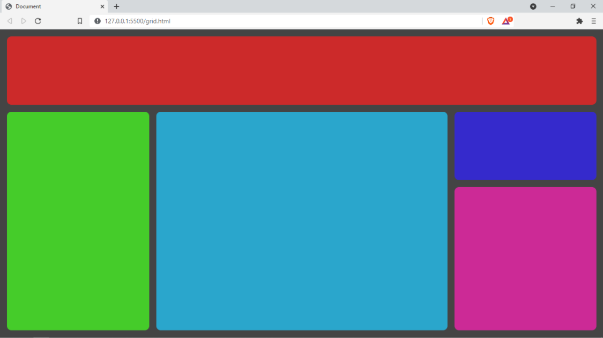

# exercitando-grid
 
 Para treinar o que foi visto nesta aula, vamos recriar a imagem a seguir utilizando as novas propriedades de grid:

 

Página do navegador com 5 elementos quadriláteros que preenchem todo seu espaço. Esses quadriláteros possuem tamanhos e cores individuais. O layout está em um grid 4x4 (4 colunas e 4 linhas). O cabeçalho ocupa todas as colunas da primeira linha. O menu lateral ocupa 3 linhas e 1 coluna. O conteúdo do meio ocupa 2 colunas e 3 linhas. O primeiro bloco restante ocupa 1 linha e 1 coluna e o segundo bloco restante ocupa 2 linhas e 1 coluna.

O layout acima é composto pelos seguintes componentes: cabeçalho, menu lateral, conteúdo do meio e dois elementos ocupando o restante do espaço lateral.

O layout está em um grid 4x4 (4 colunas e 4 linhas). O cabeçalho deve ocupar todas as colunas da primeira linha. O menu lateral deve ocupar 3 linhas e 1 coluna. O conteúdo do meio deve ocupar 2 colunas e 3 linhas. O primeiro bloco restante deve ocupar 1 linha e 1 coluna e o segundo bloco restante deve ocupar 2 linhas e 1 coluna.
